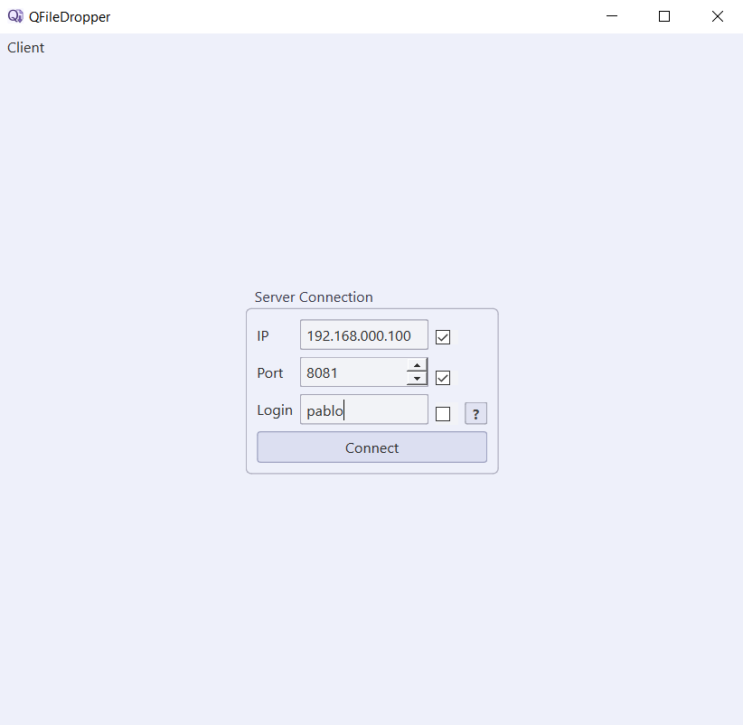
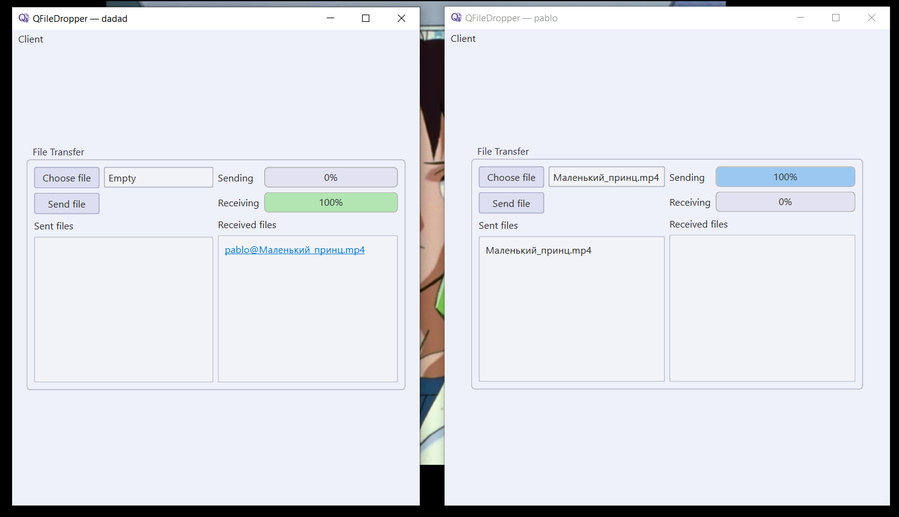
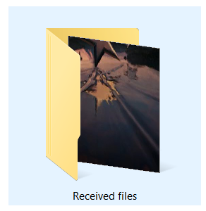
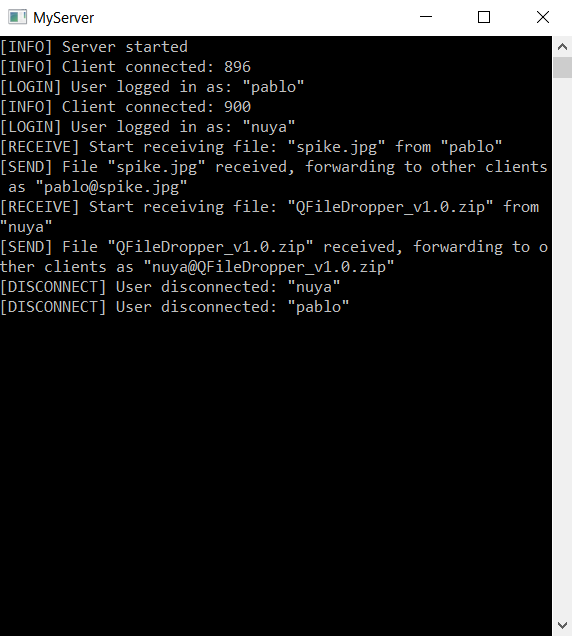

# QFileDropper

**QFileDropper** is a Qt-based application for sending and receiving files between clients via a central server.

---

## 🔹 Features

### 🖥️ Client (DropperClient)
- Send files of any size
- Progress bars for upload/download
- Stores received files locally
- Local database saves IP, port, and login
- Sound effects for success and cancellation

### 🗄️ Server (DropperServer)
- Accepts multiple client connections
- Relays files between all connected clients

---

## 🖼️ Screenshots

### 🔹 Server Connection (Client Side)
Client login screen with IP, port, and username input.  
Includes checkboxes to save connection info in a local database.  

### 🔹 Sending & Receiving Files
Client interface during active file transfers with upload/download progress bars.  

### 🔹 Received Files Directory
Received files are saved locally and displayed as clickable links.  

### 🔹 Server Logs (Terminal)
The server terminal displays incoming connections, file transfers, and status messages.  

---

## 📥 Download

⬇️ [Download the latest release](https://github.com/movavok/QFileDropper/releases/latest)

> Please download the ZIP archive under "Assets".  
> Ignore the auto-generated "Source code" links below the release.